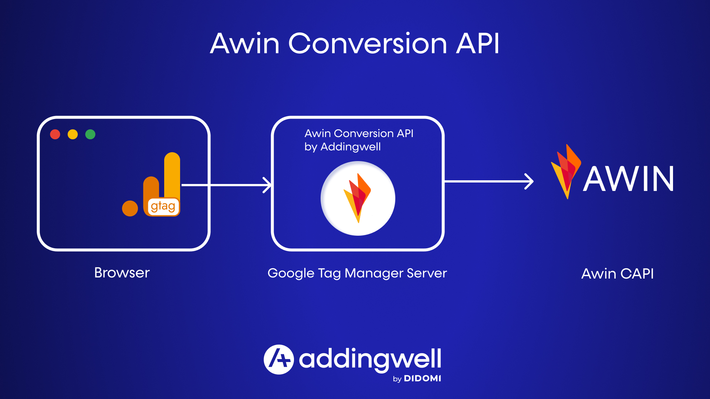
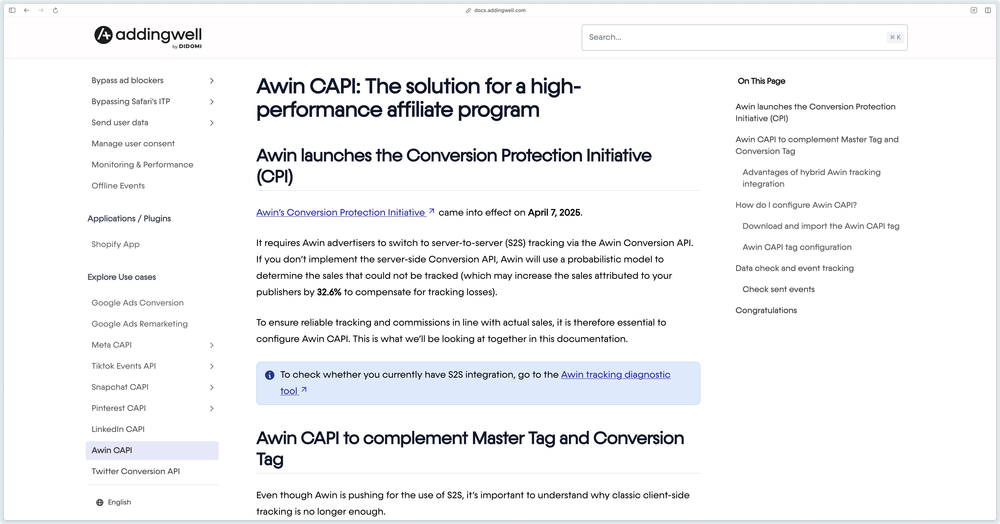

# Awin Conversion API tag for Google Tag Manager (server-side)

## How does the Awin Conversion API tag work?

## How to set up the Awin Conversion API tag?

=> Please follow our [technical documentation](https://docs.addingwell.com/en/awin-capi).

## Reporting bugs/Feedback

=> Contact us directly at [support@addingwell.com](mailto:support@addingwell.com).

## Open Source

The Awin Conversion API tag is developed and maintained by [Addingwell](https://www.addingwell.com/) under the Apache 2.0 license.