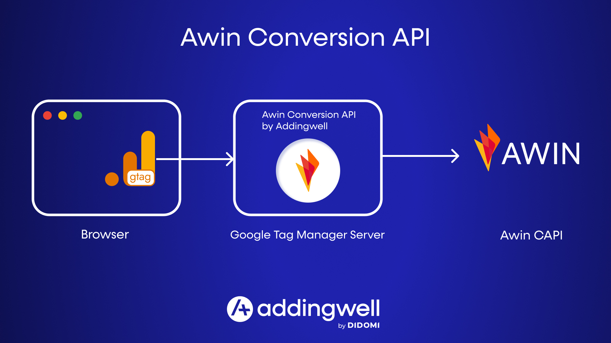
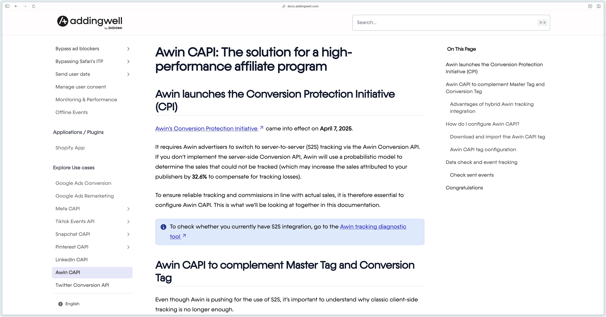

# Awin Conversion API tag for Google Tag Manager (server-side)

The **Awin Conversion API by Addingwell** tag reads event data from your GA4 client in
Google Tag Manager Server-Side and forwards it to the
[Awin Server-to-Server (S2S) Conversion API](https://developer.awin.com/apidocs/conversion-api).
It lets you track conversions and handle Awin attribution server-side, without relying on
client-side pixels.

## How does the Awin Conversion API tag work?

The tag runs in two complementary modes, selected through the **Event Type** field:

- **Page View** — Trigger on all pages. This mode does **not** send any request to Awin; it only
  reads and sets the Awin attribution cookies (`awc`, `aw_ch`, `aw_affid`, `aw_ct`, …) so that
  conversions can later be attributed correctly. It also handles channel deduplication and
  cookie configuration.
- **Conversion** — Trigger on your conversion events (e.g. `purchase`). This mode maps the GA4
  event data to the Awin conversion schema and sends the transaction to the Awin Conversion API.

### Main features

- **Automatic data mapping** — Order reference, amount, currency, voucher, channel and customer
  acquisition type are derived from GA4 event data and Awin cookies, with sensible defaults.
- **Order data override** — Override any order-level field (Order ID, Amount, Channel, Awc,
  Publisher ID, Click time, Voucher, Currency, Transaction time, Customer acquisition).
- **Items / basket data override** — Map the GA4 `items` array to the Awin basket and override
  field names (`item_id`, `quantity`, `price`, `item_category`, `item_name`, `item_brand`,
  `commission_group`, `item_sku`).
- **Commission groups** — Attribute all or part of a transaction to commission groups, either via
  a static table or a dynamic array variable, with optional per-product mapping.
- **Custom parameters** — Send up to 25 additional custom parameters to Awin.
- **Webhook notifier** — Receive real-time processing details of orders sent to Awin.
- **Deduplication & channel settings** — Configure channel deduplication query parameters,
  organic-traffic handling, and forcing the channel to `aw` when Awin click IDs are present.
- **Cookie settings** — Control cookie expiration, domain and the HTTP Only flag.
- **Test mode** — Send conversions in test mode while validating your setup.

## How to set up the Awin Conversion API tag?

You will need your **Advertiser ID** and an **OAuth2 Token**, both available from the
[Awin platform](https://ui.awin.com/) (User Dashboard and API Credentials page).

=> For complete, step-by-step setup instructions, please follow our
[technical documentation](https://docs.addingwell.com/en/awin-capi).

## Reporting bugs/Feedback

=> Contact us directly at [support@addingwell.com](mailto:support@addingwell.com).

## Open Source

The Awin Conversion API tag is developed and maintained by
[Addingwell](https://www.addingwell.com/) under the Apache 2.0 license.
